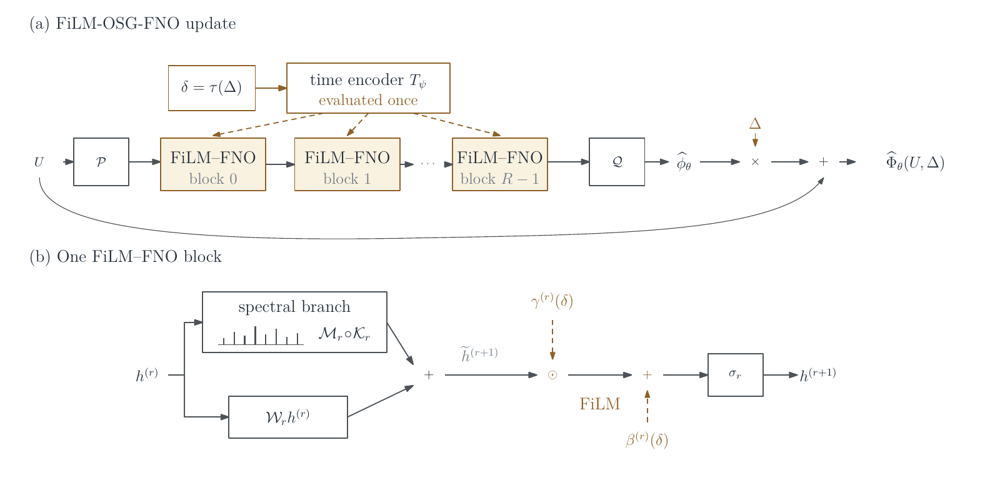

# FiLM-OSG


FiLM-OSG learns evolution operators for autonomous PDEs over a range of
evolution times. It builds on operator semigroup learning (OSG) and uses
feature-wise linear modulation (FiLM) to introduce the evolution time into the
hidden features of an operator network.



This repository contains the code for the numerical experiments in the
FiLM-OSG manuscript. The main experiments compare FiLM-OSG-FNO with OSG-FNO
using input concatenation on the Burgers, advection–diffusion, and
two-dimensional incompressible Navier–Stokes equations. Additional scripts
cover the global–local extension, PDEBench-derived data, other operator
backbones, and the diagnostics reported in the manuscript.

## Installation

The experiments use Python 3.11 and PyTorch 2.0.1. For the tested CUDA 11.7
environment:

```bash
conda create -n film_osg_clean python=3.11 -y
conda activate film_osg_clean
python -m pip install torch==2.0.1+cu117 --index-url https://download.pytorch.org/whl/cu117
python -m pip install -r requirements.txt
```

Use the PyTorch build appropriate for the local hardware. The tested package
versions are given in [`docs/environment.md`](docs/environment.md).

## Data

Training and evaluation scripts read the benchmark files from `data/` by
default; another location can be passed with `--data-dir`.

| Problem | Training file | Test file |
| --- | --- | --- |
| Burgers | `BurgersOSG_train.mat` | `BurgersOSG_test.mat` |
| Burgers with steep gradients | `burgers_sharp/BurgersSharpOSG_train.mat` | `burgers_sharp/BurgersSharpOSG_test.mat` |
| Advection–diffusion | `train_data.mat` | `test_data.mat` |
| Navier–Stokes | `VorticityOSG_train.mat` | `VorticityOSG_test.mat` |

The Burgers and advection–diffusion data can be generated with the programs in
`data/generation/`. The Navier–Stokes files follow the public DUE
benchmark format. Sources, array layouts, and generation instructions are
described in [`data/README.md`](data/README.md). Large data files are not stored
in this repository.

## Reproducing the Burgers experiment

In the command-line interface, `fno` denotes OSG-FNO with input concatenation,
and `fno_film` denotes FiLM-OSG-FNO. After preparing the Burgers data, the
following commands reproduce the five-seed comparison and generate the rollout
figure used in the manuscript. Replace `0,1` with the GPU IDs available on the
local machine.

```bash
python scripts/launch_burgers_fno.py --gpus 0,1 --models fno,fno_film --seeds 0,1,2,3,4 --tag original_burgers_core --dataset original --data-dir data
python eval/eval_burgers_fno.py --models fno,fno_film --seeds 0,1,2,3,4 --tag original_burgers_core --dataset original --data-dir data --save-dir eval_outputs_burgers_original_5seed
python scripts/plot_burgers_rollout.py --direct-model runs_burgers_fno_seed2_original_burgers_core/model --film-model runs_burgers_fno_film_seed2_original_burgers_core/model --data data/BurgersOSG_test.mat --sample -1 --steps 6,20 --out paper_figures/burgers_rollout.pdf
```

Each pair uses the same data, FNO configuration, training settings, and seed;
the treatment of the evolution time is the main architectural difference.

## Reproducing the experiments

[`docs/reproduction.md`](docs/reproduction.md) gives the commands for:

- the five-seed Burgers, advection–diffusion, and Navier–Stokes comparisons;
- data generation and the additional Burgers and PDEBench experiments;
- fixed-time, projection, Fourier, and time-partition diagnostics;
- the U-NO-style and Transolver-style comparisons; and
- manuscript figures and computational-cost measurements.

The training scripts save one directory per model and seed. Evaluation scripts
read these directories and write numerical summaries and, when requested,
rollout data for plotting. Tags identify corresponding training and evaluation
runs.

## Repository structure

| Path | Contents |
| --- | --- |
| `film_osg/` | Models, datasets, losses, and training utilities |
| `train/` | Training entry points |
| `eval/` | Rollout evaluation and numerical diagnostics |
| `data/` | Data instructions, generation programs, and local benchmark files |
| `scripts/` | Multi-run launchers, summaries, and plotting |
| `profiling/` | Parameter counts and timing measurements |
| `docs/` | Environment and complete reproduction instructions |

## Attribution and licensing

Parts of the implementation are adapted from
[AI4Equations/DUE](https://github.com/AI4Equations/due). The relevant notices
and third-party licenses are recorded in [`NOTICE`](NOTICE) and
[`THIRD_PARTY_LICENSES/`](THIRD_PARTY_LICENSES/).

A repository-wide license has not yet been assigned.
